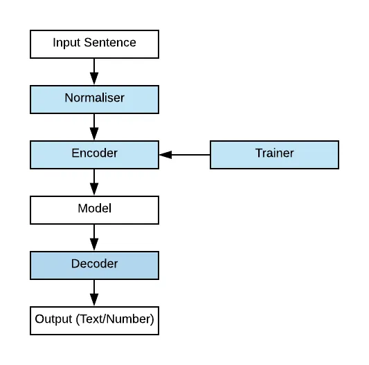
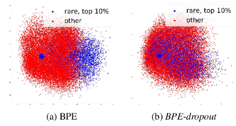
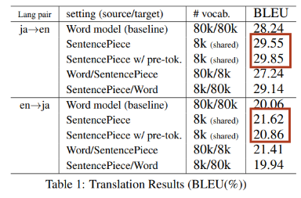
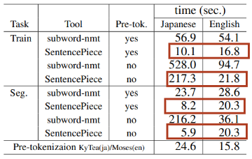
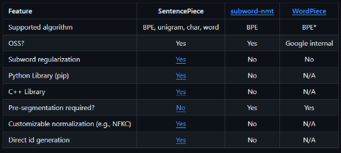

# 1. Introduction to SentencePiece tokenizer

#### 2018년 8월에 Google이 발표한 tokenizer library (Not an official Google product)
  - paper link : https://arxiv.org/pdf/1808.06226.pdf
  - Github link : https://github.com/google/sentencepiece (Implemented by Python, C++)
  

#### Pre-tokenization Free model
  - Training subword model from raw sentence
  - Language independent tokenizer

#### Fast and lightweight
  - segmentation speed : (around) 50k sentence/sec, memory usage : (around) 6MB

#### ALBERT, T5, Llama(2) 등의 Transformer 기반 언어모델에서 사용

\* The blue components are SentencePiece components in tokenization process

- Normalizer
  - != taking the mean & remove stdev
  - Altering words/letters into equivalent NFKC Unicode
  - Customizable character normalization

- Trainer
  - Training Encoder/Decoder subword model
  - BPE / Unigram Language Model in SentencePiece tokenizer

- Encoder / Decoder
  - Lossless tokenization
  - -> Decode(Encode(Normalized(text))) == Normalized(text)

# 2. Details & Strength of SentencePiece tokenizer

### Subword Regularization method
- BPE-dropout

  - corpus에 subword의 biagram을 merge할 때, 특정 비율의 list를 dropout -> 한 단어에 대한 분절 수 증가, 다양한 subword 학습 가능!
  
  - Original BPE보다 희소 단어, 오타, noisy한 단어에 대한 robustness 증가
  
- Unigram Language Model
  - n-gram language model(n=1)
    - subword에 대한 Corpus의 likelihood 계산
  - 주어진 토큰들의 공통 분포(joint distribution)의 총합이 1이 되도록(regularization) 근사(approximation)
  
### Managing merged symbols by a binary heap (priority queue)

- Time complexity of ordinary BPE algorithm : O(N^2)
  - 빈번히 등장하는 Byte Pair에 대해 우선순위 큐의 구조로 데이터 저장 -> O(Nlog(N)) 달성
  - 큰 dataset 및 subword 단위로 분할하는 경우 계산 효율성 현저히 증가 -> raw text로부터 subword model 직접 훈련 시 큰 이점!
  
### Self-contained Models
- Vocabulary, Segmentation parameters, pre-compiled script -> 필요 없다!
  - 모든 regularization 규칙, tokenizing-detokenizing logic이 model file에 내포됨 -> Guarantee perfect reproducibility
  - SentencePiece model은 binary wire format 형식의 protocol buffer로 저장(Encoding)된다.
  -> 데이터 전송 효율성, 데이터 구조 확장성 등에 용이

##### BLEU score for translation compared to other model

##### Segmentation performance of time spent

##### Comparisons with other Implementations

# 3. Limitations of SentencePiece tokenizer
### Do not considering context of sentence
- 의미적 맥락, 문법적 구조를 고려하지 않는 토큰화
  
### Difficulties in fine-tuning
- Fixed Vocabulary size -> 새로운 단어 등장 시 효과적인 모델링이 어렵다.
- pretraining data와 fine-tuning data의 불일치 (ex. 전문용어, 신조어, 어휘 크기 차이) -> transfer learning 시 어려움
### Excessive segmentation
- 과도한 토큰화 -> 토큰의 문법적, 의미적 의미 손실
- 모델이 처리해야 할 토큰의 수 증가 -> training & inference 계산량 증가
- 토큰화 과정에서 raw data의 단어 경계가 모호해짐

# 4. After the SentencePiece tokenizer
### Tokenizing method
- Multilingual Neural Tokenizer
  - https://aclanthology.org/2022.repl4nlp-1.10/
  - Word Embedding, LSTM pretraining을 통한 tokenizing
- Graph-based Tokenizer - NodePiece
  - https://arxiv.org/abs/2106.12144
  - K개의 anchor node를 정하고, anchor node와 다른 node들 간의 관계(relational context)를 tokenizing
  - Resulting hash sequence is encoded through any injective function. (ex: MLP / Transformer)
- MAGVIT - Visual Tokenizer
  - Masked Autoencoder with Grouped Visual Tokenization
  - Image를 작은 패치로 분할 후, 각 패치를 token으로 처리
  - VIT 계열 transformer 모델에서 self-attention을 통해 학습
  - LLM beats diffusion model...?

## Reference
https://huggingface.co/docs/transformers/tokenizer_summary#sentencepiece
https://medium.com/codex/sentencepiece-a-simple-and-language-independent-subword-tokenizer-and-detokenizer-for-neural-text-ffda431e704e
https://towardsdatascience.com/sentencepiece-tokenizer-demystified-d0a3aac19b15
https://velog.io/@gibonki77/SentencePiece
https://colabdoge.medium.com/understanding-sentencepiece-under-standing-sentence-piece-ac8da59f6b08
https://keep-steady.tistory.com/37
https://www.youtube.com/watch?v=zduSFxRajkE

